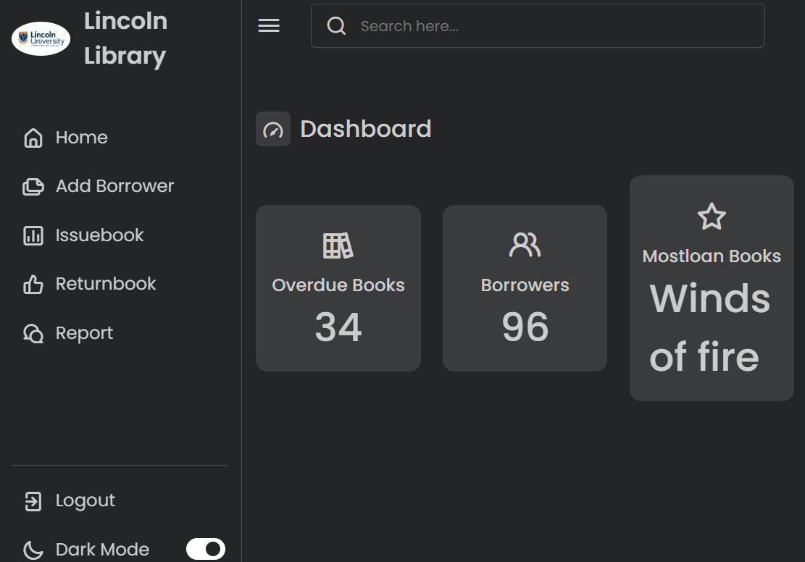

# Javascript+css+python+Flask+Agile Responsive Admin Dashboard

Compatibility/Tested:
* Chrome, Firefox, IE 11+
* Works best on screen sizes greater than ~335px

[Bavbar screenshot]


[Dark Mode]


[Toggle]


> jQuery version available on the [jQuery branch]"https://ajax.googleapis.com/ajax/libs/jquery/3.7.0/jquery.min.js"

### Stylesheets
Responsive Dashboard uses [iconscout]("https://unicons.iconscout.com/release/v4.0.8/css/line.css") for styling so we take advantage of variables to theme the dashboard.

#### Imoport Font 
[Poppins]("https://fonts.googleapis.com/css2?family=Poppins:wght@200;300;400;500;600&display=swap")

##### Widgets
A widget is essentially a white container box with some styling of sidebar.
```HTML
      <div class="logo-name">
          <div class="logo-image">
              
          </div>
          <span class="logo_name">Lincoln Library</span>
      </div>
```
##### Dashboard content with toggle
```HTML
  <div class="top">
    <i class="uil uil-bars sidebar-toggle"></i>

    <div class="search-box">
        <i class="uil uil-search"></i>
        <input type="text" placeholder="Search here...">
    </div>

  </div>
```

##### Forms
Styling for forms is included.
```HTML
<div class="container">
  <header>New Borrower</header>
    <form action="/borrower/add" method="POST">
      <div class="form first">
        <div class="fields">
          <div class="input-field">
      </div>   

  </header>
</div>
```
#### Javascript
Mainly being used to power the sidebar toggle (side in and out) and dark mode(on and off). It does a combination of detecting the browser size and managing a `toggle` cookie to keep the state the same when the page is reloaded. Check out the `"/static/nav.js"` file.


